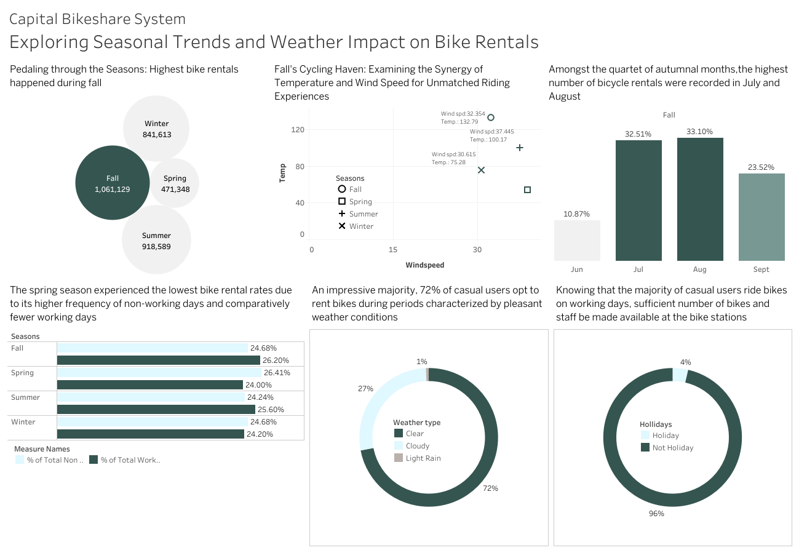

# Seasonal-trends-and-weather-impact-on-bike-rentals

## Introduction
Bike sharing systems are new generation of traditional bike rentals where whole process from membership, rental and return 
back has become automatic. Through these systems, user is able to easily rent a bike from a particular position and return 
back at another position. Currently, there are about over 500 bike-sharing programs around the world which is composed of 
over 500 thousands bicycles. Today, there exists great interest in these systems due to their important role in traffic, 
environmental and health issues. 

Apart from interesting real world applications of bike sharing systems, the characteristics of data being generated by
these systems make them attractive for the research. Opposed to other transport services such as bus or subway, the duration
of travel, departure and arrival position is explicitly recorded in these systems. This feature turns bike sharing system into
a virtual sensor network that can be used for sensing mobility in the city. Hence, it is expected that most of important
events in the city could be detected via monitoring these data.

## Questions About Business Insights

1. How does wind speed influence bike rentals? Is there a correlation between higher wind speeds and lower rental counts?

2. Do different weather conditions, such as clear skies, cloudy days, or overcast conditions, affect bike rental patterns?

3. Are there specific weather conditions that lead to a higher demand for bike rentals, such as sunny days with moderate temperatures?

4. How do seasonal weather variations impact bike rentals? Are there specific seasons or weather patterns that result in higher or lower rental counts?

5. Does the impact of weather conditions on bike rentals differ based on weekdays versus weekends?

6. Are there specific time periods within a day when weather conditions have a stronger influence on bike rental counts?

7. Can you identify any interactions or combinations of weather factors (e.g., temperature and precipitation) that have a significant impact on bike rentals?

## Skills/ Concepts Demonstrated

The following Tableau features were incorporated:
- Data Cleaning
- Range of attractive and advanced visualizations 
- Get data feature 
- Datasets filtration 
- Calculated Field
- Level of detail expressions
- Tooltips 

## Data Visualization

